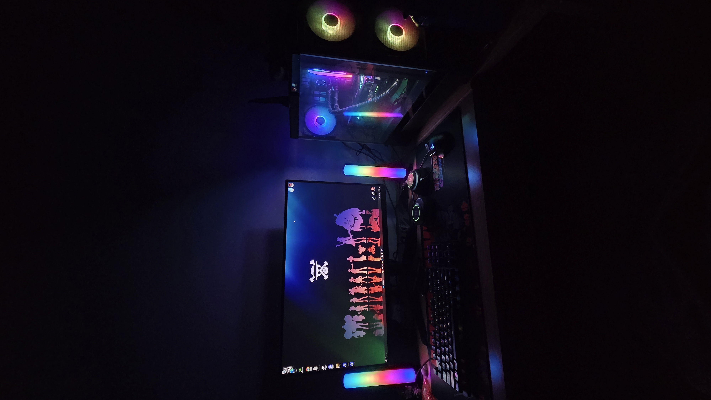

## Beyond Class

:::: {.columns}

::: {.column width="55%"}
When I'm not working with data or code, I'm usually deep in a game or an anime.

Video games are my biggest hobby, Pokémon above all, which is exactly why it keeps turning up in my work here (both the SQL database and the text analysis are built on Pokémon data). Lately I've been getting into Persona, a JRPG that scratches a similar itch and has quickly become a favorite.

On the anime side, One Piece is my all-time favorite, if you want to talk about it (or argue about it), I'm always up for it.
:::

::: {.column width="45%"}
{width=100%}
:::

::::

## Currently

- **Playing:** Persona 4 Golden
- **Watching:** Full Metal Alchemist Brotherhood
- **Always down for:** a Pokémon competitive-team discussion

Part of why I like building projects around these interests is that it lets me explore data science on my own terms, working with the kind of data most people never touch. It keeps the learning fun, and the fun keeps me learning.

