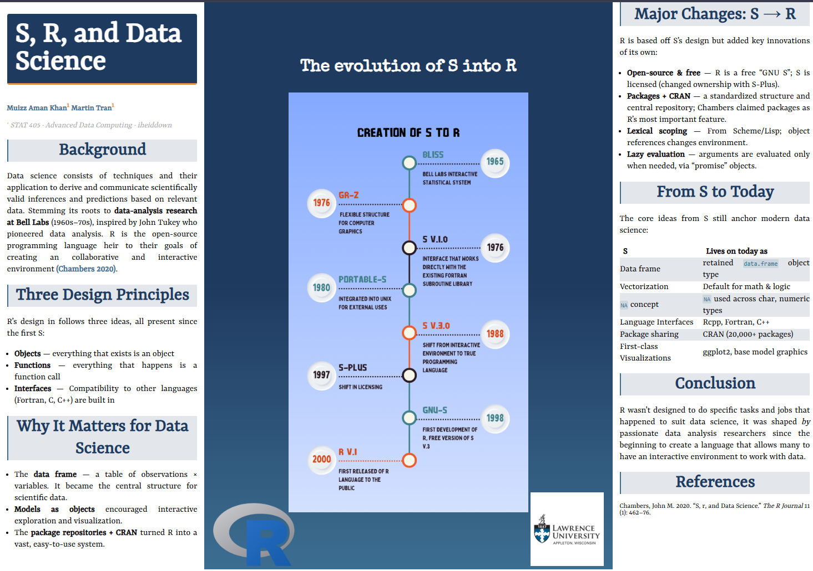

*Poster project with Martin Tran for STAT 405 (Advanced Data Computing), built in R. [Open the full poster in HTML view →](S,-R,-and-Data-Science.html){target="_blank"}*

## Overview

A conference-style research poster tracing how the **S** language (Bell Labs, 1970s)
evolved into **R**, and why S's original design principles still underpin modern data science. The entire poster (layout, theme, and content) was generated from a single R Markdown source using the posterdown (`iheiddown`) format, so it's fully reproducible from code rather than laid out by hand.

## Preview

[{width=100%}](S,-R,-and-Data-Science.pdf)

*Click the poster to open the full-resolution version PDF in a new tab.*

## What it covers

- The lineage from **S to R**, and the three design ideas carried the whole way
  through: everything is an object, everything is a function call, and interfaces to
  other languages are built in.
- Why those choices mattered for data science, the **data frame**, models as objects, and the **CRAN** package ecosystem.
- R's own innovations on top of S: open-source licensing, packages + CRAN, lexical
  scoping, and lazy evaluation.
- A comparison of core S concepts and how each lives on in R today.

## Tools

R · R Markdown · posterdown (`iheiddown` template) · custom CSS theming
