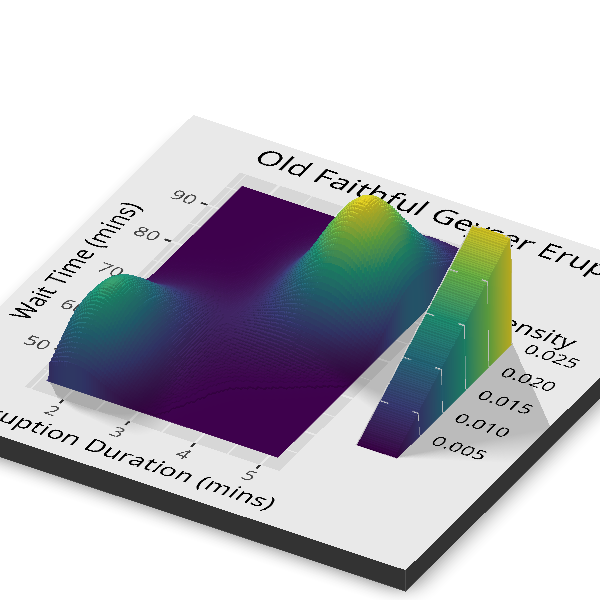

*A "R Package of the Day" talk I built and presented in R, on the [`rayshader`](https://www.rayshader.com/) package. [View the full slide deck on RPubs →](https://rpubs.com/Muizzzz/1436249){target="_blank"}*

## Overview

A short presentation introducing **rayshader**, an R package that turns data into 2D and 3D visualizations using *raytracing* which is the same lighting technique used in video games and CGI. The talk explains how rayshader builds an image (elevation matrix → shade → render), then demonstrates it on R's built-in `volcano` elevation data and on an ordinary `ggplot2` plot rendered into 3D. Built as a slide deck in Quarto and published to RPubs.

## Preview

[{width=100%}](https://rpubs.com/Muizzzz/1436249)

*Click to open the full slide deck on RPubs.*

## What it covers

- What rayshader is, and the raytracing idea behind it.
- The core pipeline: `sphere_shade()`, `ray_shade()`, `ambient_shade()`, then `plot_map()`, `plot_3d()`, and `plot_gg()`.
- **Demo 1:** the built-in `volcano` elevation dataset, as both a 2D shaded map and an interactive 3D surface.
- **Demo 2:** turning a plain `ggplot2` density plot of the Old Faithful data into a readable 3D surface where the two eruption clusters become obvious.
- Real-world uses: geography and terrain analysis, urban planning, data journalism, and game development.

## Tools

R · Quarto · rayshader · ggplot2
